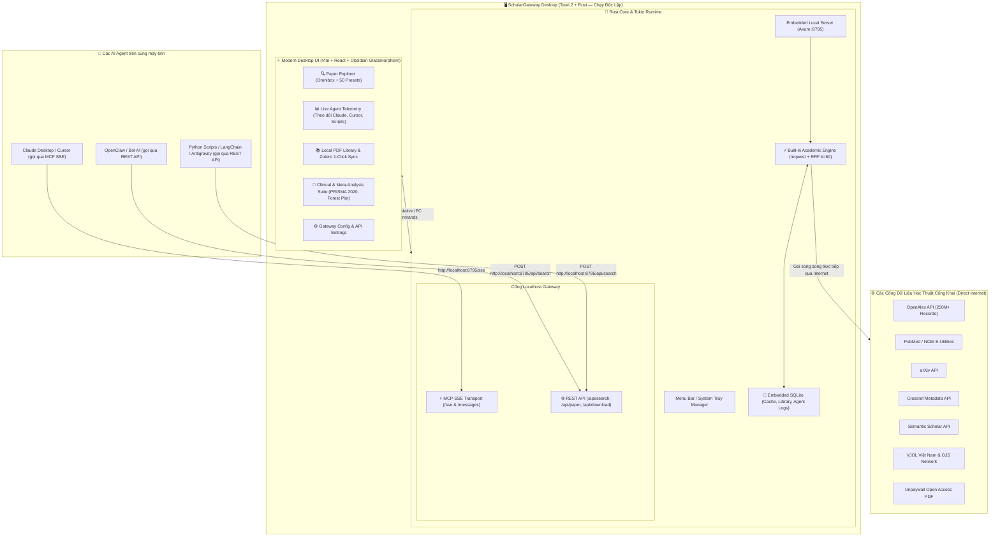

# Roadmap — ScholarGateway Desktop

> From this round on the log is written in English, matching the app and the README. Earlier entries below are kept as they were written.

## Round 5: source health checks, client setup, provider sign-in (2026-09-16)

### Per-source health check

`POST /api/source/check` probes a single source and reports what came back: result count, latency, `needs_setup`, or the source's own error. Two deliberate choices make the answer mean something:

- It **bypasses the response cache**. A health check served from cache would report a source as healthy without contacting it.
- It **clears the failure breaker first**, so the answer is "what does this source do right now" rather than "it is paused for another 240 seconds". The probe's own outcome then re-arms or clears the breaker, so checking a recovered source puts it straight back into rotation.

The probe query is chosen per source: a protein for UniProt, a CVE term for NVD, a Vietnamese phrase for the Vietnamese journals, a discipline-appropriate term otherwise, so "0 results" stays rare enough to be informative. Zero results with `ok: true` is reported as "reachable, 0 results", not as a failure.

The UI puts a Check button on each source card and a "Check active sources" button that probes the whole selection four at a time, with a stop control and a coloured dot on each pill.

Measured live through the app: OpenAlex 100/4.6s, Crossref 100/2.5s, DOAJ 100/3.4s, PubMed 100/2.9s, VJOL 25/10.8s, VAST 25/3.8s, VISTA NASATI 20/0.9s, Zenodo 25/4.4s; Scopus correctly reported as `needs_setup` ("the provider rejected the saved credential (HTTP 401)"); SLJOL HTTP 403; arXiv and Semantic Scholar reported their own rate limits.

### Default sources

A fresh install already resolved to the `auto` preset at search time, but two paths could leave the user with nothing selected: an empty saved `enabled_sources`, and switching from a preset to Custom, which handed over an empty list and silently disabled every source. Custom now seeds from whatever was active a moment earlier, and a **Restore defaults** button returns to the `auto` selection. Both are covered by tests.

### One-click setup for Claude, Codex and Antigravity

New `clients.rs` detects the AI clients on this machine and installs the MCP entry plus the bundled skills, reusing the existing safe primitives (backup, receipt, "never touch what we did not install"):

| Client | MCP config | Skills |
|---|---|---|
| Claude Code | `~/.claude.json` | `~/.claude/skills` |
| Claude Desktop | `~/Library/Application Support/Claude/claude_desktop_config.json` | — |
| Codex | `~/.codex/config.toml` | `~/.codex/skills` |
| Antigravity | `~/.gemini/antigravity/mcp_config.json` | `~/.gemini/antigravity/skills` |

Three things this needed that did not exist before:

- **TOML.** Codex is not JSON. `toml_edit` rewrites only our own table and leaves every comment and every other setting byte-identical; verified by a test that asserts the surrounding file survives an install and a removal.
- **Symlinks.** The Antigravity config on this machine is a symlink into `~/.gemini/antigravity-ide/`, and the config editor refuses to replace a symlink. Paths are now canonicalised first and the resolved path is what the panel shows.
- **Codex tokens.** Codex accepts `bearer_token_env_var`, a variable *name*, never a literal token — so the gateway token never lands in `config.toml`. The JSON clients do receive an `Authorization` header, and the panel says so.

An entry pointing at this gateway under a different name is detected and reported, but the install button stays disabled: the app does not overwrite what it did not write. Client config editing is Tauri IPC only and deliberately absent from REST, so no other local process can rewrite an AI client's config through the gateway.

Tested against a throwaway home directory containing all four clients, covering detection, install, reinstall, removal and the "someone else's entry" case for both JSON and TOML.

### AI provider sign-in

The webview sign-in previously hardcoded for Consensus and OpenEvidence is now a table of login targets, extended to the five AI providers. They point at each provider's **developer console** (platform.openai.com, console.anthropic.com, aistudio.google.com, platform.deepseek.com, perplexity.ai), not at the consumer chat apps: signing in there is ordinary, and the session is stored write-only like every other secret.

Stated plainly in the UI, because the distinction matters: a console session is not an API credential. Calls to those providers still use the API key on the same card. Consensus and OpenEvidence are the opposite — their sessions are exactly what their sources authenticate with.

### English

The UI was already English apart from four LLM key fields and the CORE key, which rendered their raw config names (`gemini_api_key`, `openai_api_key`…) because they had no label entry. Fixed, and a check confirms every credential field in the catalog now has a label. README translated to English. Vietnamese that is *functional* — query-routing keywords in `engine.rs`, the stopword list in `landscape.ts`, the Vietnamese-domain preset queries in the catalog — is kept, since translating it would break the feature it serves.

### Follow-ups in the same round

- **The default workspace name.** New installs already got "My Research", but an install from before the interface was English kept "Nghiên cứu của tôi". A migration renames it on start-up, narrowly: only when it is still exactly the name this app wrote and it is the only workspace, so a name the user chose is never overwritten. Applied to the live database — same id, same papers, same 29 queries.
- **Codex tokens, told to the user.** Installing into Codex with a gateway token set now returns the instruction it needs: `export SCHOLARGATEWAY_TOKEN=…` before starting Codex. The JSON clients get the opposite warning — the token was written into a plaintext file.
- **Config size limit.** `integrations` refused any config over 1 MiB. Claude Code keeps per-project state in `~/.claude.json`, which passes that on an active machine (136 KB here, but it grows), so the limit for config files is now 8 MiB. The 1 MiB cap on a remote MCP server's initialize response is unchanged and now has its own name.
- **A stale count.** The preset dropdown said "All 58 Specialized Presets" while listing the 53 that are not already shown as chips above it. It counts them now.

### Verification

`cargo test` 76 passed / 5 ignored; `pnpm test` 35 passed; `pnpm build` and `npx tsc --noEmit` clean. The source-check UI was exercised in a real browser against the running gateway and real upstream APIs. Client detection was run read-only against the real home directory: all four clients detected, the Antigravity symlinks resolved to `~/.gemini/antigravity-ide/mcp_config.json` and `~/.gemini/config/skills`, and nothing is installed into any of them yet.


## Đợt 4: arXiv và lỗi xếp hạng do nguồn trùng (2026-09-16)

### arXiv: không có lỗi mã, nhưng bị chôn trong kết quả

429 của arXiv ở các lượt dò trước chỉ là chặn IP do chính vòng dò dội liên tiếp; block đã tự hết. Kiểm chứng qua app thật:

- 3 truy vấn riêng: 100 kết quả mỗi lượt, 1,2–1,5s.
- 6 truy vấn liên tiếp **không nghỉ**: lượt đầu 1,6s, các lượt sau giãn đều ~3,1s theo đúng chính sách arXiv, **6/6 thành công, không 429**. Bộ điều tiết `ARXIV_GATE` hoạt động đúng.
- Dữ liệu đầy đủ: tiêu đề, năm, tác giả, abstract, PDF, `source_url`.

**Nhưng** trong tìm kiếm đa nguồn thật (preset `cs_ai`), arXiv trả 100 bài mà **0 bài vào top 6** — toàn bộ top là `papers_with_code`.

### Nguyên nhân: một feed được đếm hai lần

`papers_with_code` và `huggingface` gọi **cùng một URL** `huggingface.co/api/daily_papers?limit=50`. Hệ quả:

1. Mỗi bài trong feed vào RRF **hai lần** nên điểm gấp đôi, đè bẹp kết quả xếp hạng thật từ arXiv và OpenAlex.
2. Endpoint này **không phải công cụ tìm kiếm** — nó là feed 50 bài mới nhất, lọc phía client. Bộ lọc dùng `any` (khớp **bất kỳ** từ nào), nên "large language model reasoning" khớp 47/50 bài chỉ vì có chữ "model".

Đã sửa: lọc đổi sang `all` (phải khớp mọi từ), và gỡ `papers_with_code` khỏi catalog (Papers With Code đã sáp nhập vào Hugging Face, không còn là nguồn độc lập) — gỡ khỏi 9 preset. Thêm test chặn hai nguồn `available` cùng dùng một feed.

Kết quả cùng truy vấn, trước/sau:

| | Top kết quả |
|---|---|
| Trước | 6/6 từ `papers_with_code`, đều là bài mới của feed, liên quan lỏng lẻo |
| Sau | 3 OpenAlex + 3 **arXiv** + 2 OpenReview, đúng chủ đề (bài đầu là "Chain-of-Thought Prompting Elicits Reasoning in Large Language Models") |

`huggingface` sau khi siết vẫn đúng: "reasoning" 10 bài, "diffusion" 6, "agent" 21, "quantum chromodynamics" 0.

### Cooldown tăng dần thay cho 5 phút phẳng

Cooldown phẳng 300s khiến một lần 429 thoáng qua cắt arXiv suốt 5 phút. Nay: 60s cho lần đầu, 300s từ lần hỏng thứ 3, 900s từ lần thứ 5. Nguồn bị giới hạn tốc độ tạm thời quay lại sau một phút; nguồn chết thật vẫn lùi dần về khoảng nghỉ dài.

### Khác

`source_url` của arXiv trả về `http://` theo feed Atom — nâng lên `https://arxiv.org/abs/<id>`; có test.

### Số nguồn

Trước đợt này đo được 48 nguồn trả kết quả; `papers_with_code` trong số đó là bản sao của `huggingface`. Sau khi gỡ: **47/62 nguồn thật trả kết quả**, 10 nguồn chỉ chờ cấu hình khóa, 4 lỗi thật (`inspire_hep` không tới được từ mạng này, `sljol` chặn bot 403, `arxiv`/`dblp` chỉ 429 khi bị dội — bình thường đều chạy).

Kiểm chứng: `cargo test` 66 passed / 5 ignored; `pnpm test` 26/26; `pnpm build` đạt; bundle native build lại và xác minh qua gateway của chính nó.

## Đợt 3: timeout OJS, khóa bị từ chối, bundle native (2026-09-16)

### Số nguồn chạy được: 48/63

Dò live toàn bộ catalog: **48 nguồn trả kết quả**, 1 rỗng hợp lệ (`thaijo` thật sự không có bài cho truy vấn thử), 14 báo lỗi — trong đó **10 chỉ là chưa cấu hình khóa/phiên**. Lỗi thật còn lại chỉ 4: `arxiv` và `dblp` (chặn theo IP do chính vòng dò dội liên tiếp — curl trần cũng nhận 429 và trang "Making sure you're not a bot!", tức app xử lý đúng), `inspire_hep` (không phản hồi từ mạng này), `sljol` (403 chặn bot cứng).

### Hai lỗi mới phát hiện và đã sửa

**Timeout quá chặt cho portal OJS.** Bốn site INASP (`banglajol`, `nepjol`, `mongoliajol`, `lamjol`) lúc dò lại đều timeout dù trước đó chạy tốt. Kiểm tra riêng bằng curl: cả bốn **vẫn trả HTTP 200 nhưng mất 21–27 giây** — vượt timeout 12s vốn đặt cho API JSON. Thêm timeout riêng 35s cho request OJS; sau sửa cả bốn trả kết quả trở lại (9/17/25/15 bài).

**Khóa API bị từ chối báo nhầm thành nguồn hỏng.** Máy người dùng có khóa Scopus nên code vượt qua kiểm tra "requires SCOPUS_API_KEY" và gọi thật, Elsevier trả **HTTP 401**; UI báo "Scopus unresponsive" trong khi vấn đề là khóa sai/hết hạn. Nay 401/403 từ nguồn có khóa được gắn `needs_setup` kèm thông báo "the provider rejected the saved credential (HTTP 401)". Các mã khác (429/5xx) vẫn là lỗi thường. Có test cho cả hai nhánh.

### Bundle native

`pnpm tauri build --debug --bundles app` đạt → `src-tauri/target/debug/bundle/macos/ScholarGateway.app` (54,5 MB, 2026-09-16 00:04).

Kiểm chứng bundle nhúng đúng frontend mới: xóa `dist/` rồi build lại — `beforeBuildCommand` dựng lại dist và bundle đóng gói bản đó (`index-CkS8yQtu.js`, đúng bản đã kiểm tra trên trình duyệt). **Lưu ý: `strings` trên binary không dùng được để kiểm tra frontend** vì Tauri nén asset nhúng; chuỗi "unresponsive" tìm thấy trong binary đến từ `web_search.rs` chứ không phải UI.

Chạy .app thật và xác minh qua gateway của chính nó ở 8795: nguồn đã sửa trả kết quả (zenodo 25, openfda 10, vnu_js, banglajol 12, nepjol 6), nguồn đã gỡ bị từ chối (HTTP 400), 403 của `/api/agents` kèm header CORS đúng, và `scopus` báo `needs_setup` với lý do khóa bị từ chối.

`cargo test` 64 passed / 5 ignored; `pnpm test` 26/26; `pnpm build` đạt.

## Đợt 2: circuit breaker, ràng buộc thiết kế và giao diện (2026-09-15)

### Sự cố cần ghi nhớ

`pkill -f "<pattern>" -U $(id -u)` **sai trên macOS**: BSD pkill đòi pattern là tham số cuối, nên `501` trở thành pattern và `-f` khiến nó khớp mọi tiến trình có chuỗi "501" trong dòng lệnh. Lệnh này đã giết nhầm hàng chục tiến trình của người dùng (Chrome, Claude, ChatGPT, Antigravity IDE, Termius) và cả dev server Vite. Kiểm chứng: cùng cú pháp với pattern vô nghĩa vẫn khớp 38 tiến trình; cú pháp đúng khớp 1. **Từ nay chỉ dừng theo PID chính xác**: `kill $(lsof -nP -iTCP:8795 -sTCP:LISTEN -t)`.

### Nguồn hỏng ngoài tầm kiểm soát: circuit breaker

Nguồn bị chặn, đã ngừng hoạt động hoặc đang giới hạn tốc độ sẽ hỏng ở **mọi** lượt tìm; thử lại mỗi lần chỉ tốn đúng timeout và lặp lại cùng một dòng đỏ. Thêm bộ đếm hỏng liên tiếp theo nguồn: sau 2 lần hỏng liên tiếp, nguồn được bỏ qua trong 5 phút và báo kèm lý do; một lần thành công xóa trạng thái ngay. Nguồn chưa cấu hình khóa hoặc đang trong cooldown không tính vào bộ đếm. Đo thật trên ba lượt tìm với sljol + inspire_hep: **12,0s → 2,9s → 2,2s**.

Đã gỡ khỏi catalog (xác minh bằng curl trực tiếp, không phải lỗi mã):
- `philjol` — HTTP 410 Gone, portal đã đóng (bắt tay TLS 1.3 cũng hỏng; ép TLS 1.2 mới thấy được mã 410).
- `medpharmres` — cổng 443 đóng, chỉ còn HTTP thuần; không tự hạ cấp sang plaintext.
- `tapchi_yhoc_tphcm` (đợt trước) — tên miền nay phục vụ website khác.

`eric` giữ lại: lỗi 504 chỉ là tạm thời, đã trả 30 kết quả ở lần kiểm tra sau. REST/MCP/config đều từ chối nguồn đã gỡ (kiểm chứng: 3 nguồn gỡ trả HTTP 400, 3 nguồn sống trả 200).

### Ràng buộc nguyên tắc "một registry dùng chung"

REST, MCP và validate cấu hình đều đã chặn nguồn `available: false`. Lỗ hổng còn lại là bảng định tuyến tự động viết tay trong `engine.rs` — không ràng buộc gì với catalog, nên sẽ mục âm thầm khi một nguồn bị gỡ. Thêm test kiểm mọi id mà auto-routing và mọi preset có thể sinh ra đều tồn tại và còn `available`. Kiểm chứng test không rỗng: tạm đánh dấu `arxiv` unavailable thì test fail đúng chỗ.

`needs_setup` và `cooling_down` tự động đến MCP vì dùng chung `SearchResponse`, không cần bộ chuyển đổi riêng.

### Lỗi giao diện đã sửa

- **Badge bị ẩn toàn bộ trong danh sách**: `.compact-paper .paper-badges { display: none }` giấu cả nguồn, Open Access và loại bản ghi — đúng những thứ một app đa nguồn tồn tại để cho thấy. Nay hiện nhóm thiết yếu (nguồn, loại khác `article`, Open Access, Việt Nam) inline, giữ các badge chấm điểm cho panel chi tiết.
- **CORS che mất lý do 403**: `.layer(cors).layer(guard)` khiến guard bọc ngoài CORS, nên mọi phản hồi từ chối không có header CORS và trình duyệt chỉ hiện "Failed to fetch". Đảo thứ tự (allowlist không đổi). Màn Connections nay báo đúng "Set a gateway administrator token in Settings, then reload this page". Có test chặn hồi quy: origin tin cậy đọc được nội dung 403, origin lạ vẫn không có header.
- Lỗi lặp tên nguồn: "arXiv: arXiv: connection timed out" → còn một lần.
- `<a class="action-btn">` bị gạch chân như link thường, lệch hẳn với nút Save bên cạnh.
- Chip lọc có 0 kết quả (Explorer và Library) không chọn được, chỉ gây nhiễu — đã ẩn.
- "15643ms" → "15.6s"; thẻ AVG LATENCY "12791 ms" → "12.8 s".
- Trạng thái gateway hiện hai nơi (thanh trên + sidebar) — bỏ bản trong sidebar.
- Library: tiêu đề "Saved Papers" lặp ngay dưới tab cùng tên; "1 PAPERS" sai số nhiều → "1 saved paper". Bài đã lưu nay cũng có badge nguồn/OA như kết quả tìm.
- Connections: thẻ rỗng có viền dưới form khi chưa có token quản trị.
- Mobile 375px: header thẻ Settings có control rộng cố định ép phần tiêu đề còn một từ mỗi dòng → cho wrap. Save/Open xếp hai hàng riêng → gộp một hàng (đo lại: cả ba phần tử cùng `top`, không tràn).

### Kiểm chứng

`cargo test` 62 passed / 5 ignored; `pnpm build` đạt; `pnpm test` 26/26. Đã chạy lại gateway thật trên 8795 bằng bundle mới và kiểm tra qua GUI ở cả desktop lẫn 375px. Chưa xác minh: bundle native `.app` chưa build lại.

## Sửa lỗi nguồn và giao diện (2026-09-15, lượt kiểm tra lỗi)

Bằng chứng: test chẩn đoán `live_probe_all_sources` (ignored) gọi thật từng nguồn trong catalog; đặt `PROBE_SOURCES=id1,id2` để thu hẹp. Trước sửa: 41 nguồn có kết quả, 22 lỗi, 3 trả rỗng. Sau sửa: **46 nguồn có kết quả, 19 báo lỗi (trong đó 10 chỉ là chưa cấu hình khóa/phiên), 1 rỗng**.

Lỗi do mã nguồn, đã sửa và xác minh live:

- Zenodo luôn HTTP 400: yêu cầu không xác thực bị chặn `size > 25`. Đã kẹp `size` ≤ 25 → 25 kết quả.
- openFDA luôn lỗi giải mã: mỗi bản ghi nhãn thuốc ~180 KB, `limit=30` cho ~3 MB và vượt timeout 12s giữa lúc đọc body. Đã kẹp `limit` ≤ 10 → 10 kết quả.
- Trình phân tích OJS trả 0 kết quả trên trang có dữ liệu thật: nhiều theme (jst.vn, tapchinghiencuuyhoc.vn) đặt tiêu đề ngay trong thẻ `<a>` của bài, không có phần tử `class="title"`. Đã thêm fallback đọc chữ trong liên kết bài → jst_hust 12, tapchi_nghiencuuyhoc 10. Có test hồi quy dùng đúng HTML thật của hai theme.
- vnu_js luôn HTTP 404: js.vnu.edu.vn không bật tìm kiếm toàn site. `OjsSiteConfig` nay nhận nhiều `search_paths`; vnu_js quét song song 10 tạp chí thành viên và gộp kết quả → 26 kết quả. Một endpoint chết không còn làm trắng cả nguồn.
- tapchi_yhoc_tphcm: tên miền cũ nay phục vụ một website khác, không còn tạp chí. Đã đánh dấu `available: false` và gỡ khỏi 5 preset.
- OpenReview chèn dòng "(untitled OpenReview note)": feed trộn cả review/comment không có tiêu đề. Đã bỏ qua các note không tiêu đề → 30 còn 18 bản ghi thật.

Phân biệt "chưa cấu hình" với "hỏng":

- Nguồn cần khóa/phiên (Scopus, IEEE, Springer, CORE, Dimensions, Web of Science, Perplexity, Consensus, OpenEvidence, SearXNG) trước đây bị đếm vào cảnh báo "N/M sources unresponsive", khiến mỗi lượt tìm trông như hỏng nửa catalog. Nay các nguồn này gắn cờ `needs_setup`, hiển thị ở khối riêng "sources need setup — skipped, not failed" và không tính vào mẫu số nguồn hoạt động. Kiểm chứng live: preset Computer Science & AI báo "3/7 sources unresponsive" + "1 source needs setup" thay vì "4/8 unresponsive".
- Thông báo lỗi truyền tải không còn là chuỗi thô "error sending request for url (…)" mà nói rõ nguyên nhân: hết thời gian chờ, bị từ chối kết nối, lỗi bắt tay HTTPS, hoặc không phân giải được tên miền.

Tìm kiếm nhanh hơn: mọi nguồn được await cùng nhau nên ngân sách retry 30s của `polite_get` chính là sàn thời gian khi một nguồn bị giới hạn tốc độ. Đã hạ xuống 16s → lượt tìm thật giảm từ 27,1s còn 16,0s.

Lỗi giao diện đã sửa:

- Thanh trên tràn khỏi màn hình trong khoảng ~900–1180px: `.cockpit-top-bar` chỉ `flex-wrap` dưới 900px còn `.top-bar-actions` không co được. Ở cửa sổ 1000px, khối nút kéo dài tới 1147px nên nút làm mới và Cài đặt bị cắt mất. Nay thanh trên luôn wrap, ô tìm kiếm chiếm trọn hàng từ 1180px, select workspace và pill cổng co lại kèm ellipsis. Đo lại tại 900/1000/1160/1260px: không còn tràn.
- Tên ứng dụng ở sidebar bị cắt giữa chữ do thiếu `min-width: 0`; nay cắt bằng ellipsis.

Nguồn còn lỗi nhưng **không phải do mã của app** (xác minh bằng curl trực tiếp, cùng kết quả): medpharmres.vn đóng cổng 443 (chỉ còn HTTP), philjol.info lỗi bắt tay TLS, sljol.info chặn bot 403, api.ies.ed.gov trả 504, inspirehep.net không phản hồi từ mạng này. arXiv/Semantic Scholar/DBLP chỉ 429/500 khi bị dội liên tiếp trong lúc probe; gọi riêng lẻ vẫn bình thường.

Kiểm chứng: `cargo test` 58 passed / 5 ignored; `pnpm build` đạt; `pnpm test` 26/26 (có test mới cho phân tách needs-setup). Đã chạy lại gateway thật trên 8795 bằng bundle mới và tìm kiếm qua GUI. Chưa xác minh: bundle native `.app` chưa build lại sau các sửa đổi này.

## Kiểm tra và sửa tiếp (2026-09-15)

- Native bundle mới đã build lại và chạy bằng dữ liệu thử riêng ở cổng 9876. Kiểm tra GUI thật: tìm DOI trả danh sách, bộ lọc/phân trang hiển thị, lưu bài rồi mở Library hoạt động; không dùng phiên cũ cổng 8795 làm bằng chứng.
- Rút `SearchScanner` về một dòng trạng thái và bộ đếm thời gian; bỏ danh sách nguồn/tiến trình giả lập để giao diện nhẹ và không mô tả các bước backend chưa xác nhận. `pnpm build` và `pnpm test` đạt 24/24.
- Backend hiện tại: `cargo test` đạt 48 passed/4 ignored. MCP SDK check đạt khi chạy đúng binary mới ở cổng 9876; lệnh mặc định cổng 8795 còn trỏ phiên cũ nên không dùng làm bằng chứng.
- Native Access đã mở được trên binary mới ở cổng 9877 với database đã khởi tạo. Khi chưa đặt master token, trường tạo agent bị khóa đúng theo thiết kế; không ghi dữ liệu production để vượt qua bước bảo mật. Cần một lượt kiểm tra có token quản trị để xác minh tạo/revoke qua GUI.
- Bỏ badge ON/OFF lặp ở mục Connections trong sidebar; trạng thái cổng vẫn hiển thị ở khu vực trạng thái chính. Build và frontend tests tiếp tục đạt (24/24).
- Đồng bộ README với shell hiện tại: Search / Library / Connections; Analysis và Tools nằm trong Library, Access/MCP/Skills nằm trong Connections. Frontend build đạt sau chỉnh sửa.
- Native Access E2E đã đạt với database thử cô lập và master token thử: nhập tên, chọn workspace, tạo Read only agent, token chỉ hiển thị một lần, Test access báo `Connected. Project access verified.`, Done ẩn token. Không đụng dữ liệu production; Revoke chưa bấm vì đây là thao tác xóa cần xác nhận.

- Bộ lọc tìm kiếm mặc định thu gọn, hiển thị phạm vi/năm ở summary; thêm Apply filters để gửi giá trị đã chỉnh. Cài đặt nâng cao (LLM, phiên web, SearXNG, thông số gateway, cache) nằm trong details mặc định đóng; phần bảo mật vẫn mở trực tiếp. Không bỏ controls, không đổi dữ liệu cấu hình. Frontend build đạt; kiểm thử mới xác minh mở bộ lọc và gửi year_min bằng Apply.

- Phát hiện lỗi live: preset cs_ai chứa searxng, nhưng khi chưa cấu hình URL engine tự gọi Europe PMC. Đã tách lựa chọn searxng khỏi alias metasearch; searxng chưa cấu hình báo lỗi nguồn, không dùng fallback y sinh. Cấu hình không còn đổi searxng thành metasearch. Thêm test không mạng chống hồi quy.
- Chạy live_multidisciplinary_search thành công sau sửa: AI, kinh tế, giáo dục, y sinh đều trả 3 kết quả theo giới hạn/năm. Đây là xác minh luồng và kết quả hợp nhất, không chứng minh mọi nguồn hoạt động. arXiv không kết nối được trong lần kiểm tra riêng (12 giây); Semantic Scholar/DBLP có lỗi ở lượt AI, vẫn báo trạng thái từng nguồn. Live DOI Crossref đạt.
- Library chuyển thành danh sách gọn và panel chi tiết khi chọn bài; giữ ghi chú/tags/trạng thái/yêu thích. Khôi phục nút Settings trên mobile (trước đó cả hai đường truy cập đều bị CSS ẩn).
- Frontend build đạt; test panel Library kiểm tra mở/đóng, focus, yêu thích và đọc ghi chú. Bundle native đã build trước đó không chứa các sửa đổi ngày 15/09; cần build lại khi kiểm tra native cuối.
- Mục tiêu vẫn hoạt động: còn gom bộ lọc/Settings/Connections, kiểm tra GUI native và viewport mới; không coi trạng thái khóa màn hình là lý do bỏ các phần vẫn có thể triển khai bằng mã.

## Triển khai kế hoạch tối giản (2026-09-14, đang thực hiện)

### Tiến độ quyền agent

- Thêm agent_credentials riêng: token ngẫu nhiên, chỉ lưu SHA-256; danh sách workspace, quyền đọc/ghi, thu hồi. Chỉ quản trị tạo/list/revoke. Không tắt master khi còn agent hoạt động.
- Guard REST và dispatch MCP kiểm tra quyền dự án; lọc danh sách workspace, chặn details/citations/save đối với bài chỉ nằm ngoài phạm vi. Read-only không ghi lịch sử dự án. Chặn agent gọi cấu hình, filesystem, telemetry toàn cục, quản lý token; không cho tự truyền endpoint SearXNG vào tìm kiếm REST.
- Rate limit theo danh tính xác thực, SSE gắn chủ phiên; revoked token bị từ chối mỗi request. Request đang chạy trước thu hồi có thể hoàn tất.
- Connections → Access: chọn tên/quyền/dự án → tạo → copy config/test → done; token chỉ ở state bộ nhớ. Revoke cần xác nhận. Không tự thay đổi token hoặc dữ liệu production để kiểm thử.
- Kiểm chứng: backend 47 passed/4 ignored mặc định; ba test quyền bao phủ REST/MCP, truy cập chéo, giả header, read-only, hash/thu hồi/rate-limit/SSE. Frontend 22/22 gồm create/test đúng token/revoke confirmation. SDK fixture đạt anonymous/admin/scoped-reader qua HTTP thật. Native GUI và responsive của màn hình mới chưa xác minh.
- Còn: thu gọn giao diện/filter/library/settings, kiểm chứng nguồn live, native E2E và viewport, kiểm tra installer/config client end-to-end; chưa hoàn tất mục tiêu.

### Ghi chú kiểm tra runtime

- Mobile viewport 390×844 đã kiểm tra bằng browser: thanh điều hướng chuyển xuống đáy, ô tìm kiếm và workspace switcher không tràn, nút trạng thái được rút gọn. Connections hiển thị Access/MCP & Skills/Activity theo chiều dọc.
- Native `pnpm tauri build --debug --bundles app` đạt, tạo `src-tauri/target/debug/bundle/macos/ScholarGateway.app`. Phiên desktop cũ vẫn giữ port 8795 và trả 404 cho `/api/agents`; app mới không thể mở UI vì macOS đang khóa màn hình. Cần mở khóa rồi chạy bundle mới để kiểm tra Access E2E thật; không dùng kết quả runtime cũ làm bằng chứng.

### Tiến độ MCP và skills

- MCP đã đồng bộ schema workspace_id/status/favorite/tags; thêm fields cho tìm kiếm, details, citations và workspace. Giữ provenance và lỗi nguồn; danh sách mặc định compact. Lưu projection dùng metadata đầy đủ sẵn có, tránh mất abstract.
- get_workspace phân trang SQLite thực sự (20 mặc định, tối đa 100), thứ tự ổn định khi trùng timestamp, next_offset/total; truy vấn gần đây chỉ trang đầu. Tìm kiếm trả next_offset.
- Đóng gói ba skills trong skills/paper-search, skills/paper-collect, skills/research-resume, nhúng vào binary và dùng installer sẵn có. UI chọn/preview/xác nhận cài, không tự cài vào môi trường người dùng.
- Kiểm chứng: Rust 44 passed, 4 ignored mặc định (3 test mạng + SDK fixture cần Node). SDK fixture chạy riêng thành công có/không token, kiểm tra schema, trang kế tiếp và fields qua HTTP thật. Ba skill qua quick_validate và test cài/bật-tắt/chống ghi đè/giữ sửa đổi. Frontend build đạt, 21/21 tests gồm xác nhận cài đặt.
- Vẫn còn: token agent riêng/quyền workspace/thu hồi, nguồn live, giao diện đơn giản hóa tiếp và E2E native/responsive đầy đủ. Chưa hoàn tất mục tiêu.

- Đã đổi điều hướng thành Search / Library / Connections; Settings ở cuối sidebar. Analysis giữ trong Library → Tools.
- Đã bỏ dashboard khỏi landing tìm kiếm; tải trễ Library, Connections, Settings và Analysis.
- Kết quả tìm kiếm dạng hàng gọn, lưu/mở trực tiếp, chọn tiêu đề để mở panel chi tiết; Escape đóng và trả focus về tiêu đề. Giữ abstract, tải PDF, citation graph và các thao tác trích dẫn.
- Đã bỏ gradient/blur của shell, sửa tương phản chữ sidebar và giảm bóng đổ.
- Xác minh: build đạt; Vitest 20/20, gồm hồi quy panel/focus/lưu một thao tác. Browser localhost:1420 xác nhận landing và Library/Tools. Chưa xác minh đủ responsive hoặc kết quả tìm kiếm live của panel mới.
- Còn làm: gom bộ lọc/menu phụ và đơn giản hóa Library/Settings/Connections; loại trạng thái lặp trên shell; kiểm chứng nguồn thật; token riêng có quyền theo workspace và thu hồi; kiểm thử E2E/quyền/viewport đầy đủ. MCP phân trang/chọn trường và bộ ba skills đã triển khai như tiến độ phía trên.
- Các mở rộng toàn văn, semantic search, cảnh báo bài mới và tổng hợp có dẫn chứng vẫn là giai đoạn sau khi cần, không phải tiêu chí của đợt đầu. Chưa tuyên bố hoàn tất mục tiêu.

## Mục tiêu và phạm vi (2026-09-12)

Một ứng dụng local-first tìm kiếm đa ngành, kết nối nhiều nguồn, cung cấp MCP cho AI Agent và quản lý cài đặt skills/MCP. Y khoa là một nhóm ngành tùy chọn; giữ chức năng đang có. Phần thiết kế cũ bên dưới là lịch sử đề xuất, không phải bằng chứng tính năng đã hoạt động.

## Kiểm kê thực tế (2026-09-12)

- React 19/TypeScript + Tauri 2/Rust, SQLite, Axum local gateway; thư mục không có Git metadata.
- Engine có OpenAlex, PubMed, arXiv, Crossref, OpenAlex Việt Nam, Europe PMC (nhãn MetaSearch) + SearXNG ngoài tùy chọn; mỗi bài có `source_url`; lọc OA/năm ở server; `available_total` cho phân trang.
- UI 5 workspace: Tìm Kiếm (bài báo/web), Nghiên Cứu Của Tôi (workspace), Agent Gateway, Phân Tích, Cài Đặt; omnibox cố định trên thanh trên.
- Workspace là thực thể SQLite riêng (`workspaces`, `workspace_papers` + `note`); search_history/download_history gắn `workspace_id`; Agent đọc trọn dự án qua MCP `get_workspace`.
- MCP Streamable HTTP `/mcp`, SSE `/sse`+`/messages`, 7 tool; HTTP/SSE đã test nội bộ + test REST workspace qua TCP thật, **chưa** test bằng SDK/client ngoài.
- Bảo mật: token (khi đặt) bảo vệ mọi route trừ health + `GET /api/config` đã lọc; secret chỉ-ghi (`__SG_KEEP__`); SQLite `0600`, thư mục `0700`; gateway chỉ loopback + origin allowlist + CSP.
- Tauri IPC chỉ còn cho việc cần chạy in-process (settings, credential, file, skills/MCP config); các lệnh library/search cũ đã bỏ vì UI đi qua REST.

## Danh sách tính năng và trạng thái

| Phần | Tính năng | Trạng thái |
|---|---|---|
| 1. Nguồn và ngành | Preset đa ngành, registry **10 nguồn**, routing theo từ khóa | OpenAlex, Crossref, Semantic Scholar, arXiv, PubMed, DOAJ, Zenodo, HAL, OpenAlex VN, Europe PMC — đã kiểm chứng live (DOAJ/Zenodo/HAL trả kết quả thật; Semantic Scholar có thể 429 khi thiếu key); DBLP loại vì chặn bot |
| 2. Explorer | Preset, năm/OA/giới hạn, lỗi riêng từng nguồn, chống trùng, DOI, `source_url`, tải PDF, citation, "Tải thêm" | Đã có; lọc OA/năm ở server; chờ xác minh live UI |
| 3. Settings | Ngành/nguồn/credentials, timeout, TTL, limit, thư mục tải, port, token; load/save/validation | Đã nối đầy đủ + validate + secret chỉ-ghi; secret chưa dùng OS keychain |
| 4. Kết nối tìm kiếm | Nguồn học thuật + connector web SearXNG; phân biệt paper/web | HTTP fixture + UI/REST/MCP đạt; chưa xác minh instance live; web chưa có cache/history |
| 5. MCP cho Agent | initialize/list/call, HTTP + SSE, search/details/catalog + workspace tools | Đã có 7 tool + token; còn SDK/client live verification |
| 6. Cài MCP | Thêm/sửa/xóa cấu hình client, enable/disable, test, backup/receipt | Đã có UI/IPC + backup + test HTTP initialize; còn native E2E, stdio/SSE test |
| 7. Cài skills | Xem/cài/gỡ/bật-tắt skill local | Đã có IPC/UI + test filesystem; còn native E2E + hardening fs đồng thời |
| 8. Công cụ nghiên cứu | Workspace dự án + trạng thái đọc/yêu thích/tags + ghi chú + xuất .RIS/BibTeX; APA/Vancouver; citation graph + bài liên quan (UI + REST + MCP); lưu truy vấn; phân trang offset; PRISMA 2020; meta-analysis; cảnh quan kết quả | Đã có đầy đủ; "gap analysis" là **cảnh quan mô tả** (năm/nguồn/thuật ngữ/độ phủ) có cảnh báo, **không** phải kết luận khoảng trống học thuật |
| 9. Bảo mật và đóng gói | Loopback/origin/token, keychain, rate limit, secret không lộ, migration, CI, tương thích MCP SDK | Token toàn route + keychain (fallback SQLite) + rate limit + secret chỉ-ghi + `0600` + CSP + CI + native E2E binary + **MCP SDK chính thức**; còn tương tác GUI E2E |

## Nguyên tắc triển khai

1. Kiểm tra phần liên quan → sửa nhỏ đủ luồng → chạy test/build → ghi kết quả; không đánh dấu hoàn tất chỉ dựa vào giao diện hoặc stub.
2. Ưu tiên registry/cấu hình dùng chung, tránh ba bộ preset khác nhau ở UI/REST/MCP. Alias cũ giữ tương thích khi đúng nghĩa.
3. Cài skills/MCP là chức năng trong app, không tự cài vào môi trường Codex/Antigravity của người dùng khi xây dựng.
4. Chỉ hoàn tất mục tiêu khi toàn bộ bảng trên có bằng chứng thực tế; không chỉ đổi nhãn y khoa thành đa ngành.

## Nhật ký xác minh

- Lượt 40: Rút gọn thành Nhóm Nguồn & Tinh giản Quản lý 66 Nguồn học thuật (Settings & Explorer):
  1. Yêu cầu người dùng: "rút lại thành nhóm đi; liệt kê nguồn nhiều quá".
  2. Tinh giản Preset: Thay thế lưới 58 card cuộn khổng lồ bằng thanh công cụ preset tối giản: 6 nút bấm nhanh cho các preset chính (`⚡ Tự động (Khuyên dùng)`, `🌐 Toàn diện (66 nguồn)`, `🇻🇳 Học thuật Việt Nam`, `🧬 Y sinh Quốc tế`, `🤖 Khoa học Máy tính & AI`, `🛠️ Tùy chỉnh cá nhân`), dropdown gọn gàng cho 58 preset chuyên ngành, và dòng tóm tắt số nguồn được kích hoạt theo thời gian thực.
  3. Rút gọn 66 nguồn thành 8-9 nhóm lĩnh vực cốt lõi (`Chỉ mục Đa ngành`, `Y sinh & Lâm sàng`, `CS, AI & Kỹ thuật`, `Tạp chí Việt Nam`, `AI & Tổng Hợp`, `Kho Dữ liệu & Mở`, `Kinh tế & Xã hội`, `Vật lý & Tự nhiên`, `Khu vực & Nam Bán Cầu`).
  4. Mỗi nhóm lĩnh vực hỗ trợ: nút bật/tắt toàn bộ nhóm trong 1 click, pill nguồn nhỏ gọn có trạng thái check/màu sắc (bấm trực tiếp để toggle), chế độ mở rộng xem chi tiết và kiểm tra API key/polite pool, thanh tìm kiếm tức thì tự động mở rộng nhóm khớp từ khóa.
  5. Kiểm chứng: `pnpm build` (777ms, 0 errors), `pnpm test` (11/11 passed), Live E2E test qua Playwright kiểm chứng chuyển preset, bật tắt nhóm và lọc tìm kiếm.

- Lượt 39: Tối giản hóa & Hiện đại hóa giao diện toàn diện + Animation tìm kiếm đa nguồn thời gian thực:
  1. Giữ nguyên 66 nguồn học thuật (gồm cả DBLP, Consensus, OpenEvidence).
  2. Triển khai `<SearchScanner />` (`src/components/SearchScanner.tsx`) hiển thị radar quét, tia laser tiến trình, và hệ thống chip nguồn động phát sáng theo thời gian thực (cho biết chính xác đang quét cơ sở dữ liệu nào: OpenAlex, PubMed, arXiv, Crossref, Europe PMC, Consensus, bioRxiv, DOAJ, Zenodo, VJOL...).
  3. Tối giản hóa thông tin ("ít chữ", "gọn tối giản"): Cắt giảm các khối văn bản dài dòng trên TopBar, Dashboard và Explorer; chuyển bộ lọc năm thành các nút tắt nhanh (`Tất cả`, `5 năm gần đây`, `Năm nay`); rút gọn thẻ bài báo và nút hành động.
  4. Nâng cấp CSS design tokens & keyframes (`scan-beam`, `radar-pulse`, `source-glow`, `fade-in-up`).
  5. Kiểm chứng toàn diện: `cargo test` (38 passed/3 ignored), `pnpm test` (11 passed), `pnpm build` (761ms, 0 errors). Kiểm chứng trực quan qua Playwright browser với ảnh chụp thực tế màn hình Dashboard, trạng thái quét Scanner và kết quả bài báo.

- Lượt 38: Độc lập 100% Desktop App với luồng đăng nhập OAuth / Web Session cho Consensus.app & OpenEvidence:
  1. Dọn dẹp catalog: Loại bỏ 30 nguồn chặn bot / không có API công khai, giữ lại và kích hoạt Consensus & OpenEvidence (tổng cộng 66 nguồn hợp lệ).
  2. Native Webview Login: Tauri IPC `open_service_login` mở cửa sổ webview riêng với Safari User-Agent (vượt qua giới hạn `disallowed_useragent` của Google OAuth), tự động tiêm JS observer bắt token/session cookies (`__session`, Clerk JWT, localStorage) khi người dùng đăng nhập xong, điều hướng về `/__scholargateway_session__` được Tauri `on_navigation` chặn bắt và lưu thẳng vào macOS Keychain (`secrets.rs`) rồi tự đóng cửa sổ.
  3. Connector trực tiếp: Rust backend gọi thẳng `https://consensus.app/api/paper_search/` và `https://www.openevidence.com/api/chat` bằng token/cookie đã lưu, không phụ thuộc bất kỳ sidecar hay proxy trung gian nào.
  4. UI Settings: Bổ sung card quản lý Web Session trực quan với huy hiệu trạng thái (Đã lưu / Chưa đăng nhập), nút "Đăng nhập qua Webview", nút "Xóa session" và ô nhập thủ công dự phòng.
  5. Kiểm chứng: `cargo test` 38 passed/3 ignored, `pnpm test` 11 passed, `pnpm build` đạt 100%.

- Lượt 37: Dọn dẹp triệt để Catalog theo nguyên tắc "chỉ dùng trang gốc có API chính thức, không dùng trang cấm bot/lách" (94→64 nguồn). Loại bỏ hoàn toàn 30 nguồn không có API công khai hoặc cấm bot (Google Scholar, SSRN, SciELO, ChemRxiv, Consensus, OpenEvidence, Epistemonikos, PatentsView, OSTI, NASA ADS, FRED, govinfo, OATD, PhilPapers, ISRCTN, DOAB, J-STAGE, WHO IRIS, Software Heritage, BASE, Lens...). Đồng bộ toàn bộ mô tả 58 Presets phản ánh chính xác nguồn đang dùng. Placeholder SettingsPage chuyển thành động (`Tìm ${SOURCES_LIST.length} nguồn...`). Chạy kiểm chứng: `cargo test` 38 passed/3 ignored, `pnpm test` 11 passed, `pnpm build` đạt 100%.

- Lượt 36: Thêm 8 nguồn công khai nữa (56→64). **Europe PMC** tách nguồn riêng, **openFDA** (nhãn thuốc), **UniProt** (protein), **ClinVar** + **NCBI GEO** (eutils 2 bước), **Figshare**, **SEC EDGAR**, **CISA KEV** (feed lọc client-side). Thêm retry/backoff cho eutils (429) và email liên hệ. Mở rộng `paperKind` với `record` và map các nguồn mới (dataset/report/advisory/record). Kiểm chứng binary: cả 8 trả kết quả thật (GEO/ClinVar sau khi thêm retry; CISA KEV khớp "windows"). `cargo test` 38 passed/3 ignored, `pnpm test` 11 passed, `pnpm build` đạt. Còn 30 nguồn: chặn bot (Google Scholar, SSRN, SciELO, J-STAGE, OSF, chemrxiv, who_iris, software_heritage, OATD, PhilPapers, ISRCTN, doab) hoặc cần key (BASE, Lens, Consensus, OpenEvidence, Epistemonikos, PatentsView, OSTI, NASA ADS, govinfo, FRED, pubchem, rcsb_pdb, acl_anthology, uspto, patentsview, lens, chemrxiv).

- Lượt 35: OpenAIRE + keyed + tách loại record. Thêm **OpenAIRE** (parser SOAP-in-JSON), **CORE/Dimensions/Web of Science** (keyed, credentials `core_api_key`/`dimensions_api_key`/`wos_api_key`) và 3 nguồn phi-bài-báo **NVD CVE**, **Hugging Face Datasets**, **Stack Exchange**; nối engine, bật `available` (49→56) và thêm vào preset. Thêm `lib/paperKind.ts` phân loại `article/dataset/report/advisory/discussion/software`; Explorer có badge + bộ lọc **Loại**, Library có badge; test phân loại. Kiểm chứng binary: OpenAIRE/NVD/HF/Stack Exchange trả kết quả thật; CORE/Dimensions/WoS báo lỗi rõ khi thiếu key (`requires CORE_API_KEY`…). `cargo test` 38 passed/3 ignored, `pnpm test` 11 passed, `pnpm build` đạt. Còn ~38 nguồn chưa hỗ trợ (chặn bot hoặc cần key) — đã ghi rõ lý do.

- Lượt 34: Triển khai thêm nguồn công khai. Thêm module `sources/public_apis.rs` với **CiNii, Dryad, Dataverse, NTRS, World Bank, DOAB** và 2 cấu hình OJS **AJOL, ThaiJO**; nối vào engine (has_source/future/join/collect) và bật `available` (42→49). Kiểm chứng live: CiNii/Dryad/Dataverse/NTRS/World Bank/AJOL/ThaiJO đều trả kết quả thật. **DOAB** trả `ok=false`/không có `dc.title` ở endpoint nhanh → **hạ về chưa hỗ trợ**. Sửa NTRS đọc `id` dạng số. Phát hiện **stack overflow** khi future fan-out quá lớn (thêm ~42 future) → box future engine (`Box::pin`) trong `search_handler` để nằm trên heap. `cargo test` 38 passed/3 ignored (đã có test catalog bắt buộc preset chỉ tham chiếu nguồn available), `pnpm build` đạt. Còn ~45 nguồn chưa hỗ trợ (chủ yếu cần key, dữ liệu phi-bài-báo như PubChem/CVE/patent, hoặc bị chặn bot như Google Scholar/SSRN/SciELO).

- Lượt 33: Sửa logic sau khi người dùng mở rộng nguồn. Catalog tăng lên **94 nguồn** nhưng engine chỉ thực thi **42** → 52 nguồn bấm vào không làm gì (im lặng). Thêm cờ `available` vào `searchCatalog.json` (true cho 42 nguồn có logic), prune mọi preset chỉ còn nguồn khả dụng (chuẩn hóa alias `europe_pmc`→`metasearch`); preset rỗng (us_gov) bị ẩn. Gating: `catalog.rs` đọc `available` + test preset chỉ tham chiếu nguồn available; `config.rs validate_patch` từ chối nguồn chưa hỗ trợ; MCP `search_arguments` từ chối; REST `search_handler` trả 400; UI Settings/Explorer chỉ hiện nguồn & preset khả dụng (kèm dòng "N nguồn chưa hỗ trợ"). Rà module `sources/*` mới (OJS scraper, keyed Scopus/IEEE/Springer/Perplexity, biomedical, open_repos, ai_search, nasati): trả `Err` rõ khi thiếu key/HTTP lỗi, không lộ key trong thông báo, áp year filter ở OJS. Kiểm chứng binary: catalog 42 available; `sources:["scielo"]` → 400; PLOS/PMC trả kết quả thật. `cargo test` 38 passed/3 ignored, `pnpm build` đạt. Còn: 52 nguồn chưa triển khai (cần key/API hoặc bị chặn bot).

- Lượt 32: Bổ sung nguồn + làm lại UI Settings. Thêm **Semantic Scholar** (key tùy chọn, `semantic_scholar_api_key` là secret), **DOAJ**, **Zenodo**, **HAL** vào catalog/engine/RRF (6→10 nguồn); thử **DBLP** nhưng bị bot-wall (HTML "not a bot") nên loại. Cập nhật preset, routing `auto`, credentials, và test routing. Kiểm chứng live trên binary: DOAJ/Zenodo/HAL trả kết quả thật kèm `source_url`; Semantic Scholar 429 khi thiếu key (báo lỗi rõ theo từng nguồn). **Settings viết lại** còn 3 nhóm: Nguồn dữ liệu (preset + toggle nguồn, báo đủ/thiếu khoá), Kết nối & Khoá (LLM, credentials theo nguồn, MetaSearch/SearXNG), Gateway & Bảo mật (token, port, rate limit, timeout, cache, thư mục tải, tìm web). Giữ nguyên load/save + sentinel + test. `cargo test` 38 passed/3 ignored, `pnpm test` 10 passed, `pnpm build` đạt, bundle rebuild + chạy thật.

- Lượt 31: Ba hạng mục còn lại. (1) **MCP SDK chính thức**: thêm `@modelcontextprotocol/sdk`, script `scripts/mcp-sdk-check.mjs` + `pnpm mcp:check`; chạy trên binary thật: connect → 8 tool → catalog → workspaces → get_workspace, đạt cả khi bật token. (2) **Phân trang offset**: `SearchRequest.offset`; engine lấy `limit+offset` mỗi nguồn (trần 100) rồi `skip/take`; cache hash v6 gồm offset; MCP schema thêm `offset` (0–10000); Explorer "Tải thêm" dùng offset và ghép kết quả (khử trùng). Kiểm chứng binary: trang 0 và trang offset=3 trả bài khác nhau. `available_total` là chặn dưới vì phụ thuộc offset. (3) **Cảnh quan gap analysis thật hơn**: `lib/landscape.ts` tính histogram năm, phân bố nguồn, venue, tác giả, OA, thuật ngữ nổi bật, độ phủ từ khóa truy vấn; hiển thị trong ResearchGapPanel kèm cảnh báo "mô tả, không phải kết luận". Build TS/Vite đạt; Rust 38 passed/3 ignored; frontend 10 tests (thêm landscape). Còn: tương tác GUI E2E, viewport hẹp.

- Lượt 30: UI citation graph trong Explorer. Thêm endpoint query `GET /api/citations?id=…&direction=…&limit=` (tránh ID OpenAlex chứa `/`); nút "Trích dẫn & liên quan" mở panel với 3 tab (Được trích dẫn / Tham chiếu / Liên quan), hiển thị bài + link nguồn + nút lưu vào workspace. Kiểm chứng trên binary thật sau rebuild bundle: `unknown-id` trả lỗi rõ ràng, DOI `10.1038/nature14539` trả về bài được trích dẫn thật từ OpenAlex; PATCH paper trả status/favorite/tags; bundle chạy bình thường. `cargo test` 38 passed/3 ignored, `pnpm test` 8 passed, `pnpm build` đạt. Còn: MCP Inspector chính thức, cursor pagination, gap analysis thật.

- Lượt 29: Làm sâu workspace. `workspace_papers` thêm `status` (unread/reading/read), `favorite`, `tags` (migration cột); PATCH `/api/workspaces/{id}/papers?paper_id=` nhận `note/status/favorite/tags` (partial update, validate status, tags ≤20×40 ký tự, khử trùng). `search_history` thêm `saved`; PATCH `/api/history/searches/{id}` lưu/bỏ lưu; list sắp saved trước. MCP `save_paper_to_workspace` nhận thêm status/favorite/tags; `get_workspace` trả đủ; `get_citations` thêm direction `related` (OpenAlex `related_works`). UI Library: tab lọc theo trạng thái/yêu thích, nút trạng thái, star, ô tags, badge; SearchHistory: toggle lưu + lọc "chỉ đã lưu". Kết quả: `cargo test` 38 passed/3 ignored, `pnpm test` 8 passed, `pnpm build` đạt. Còn: UI citation graph trong app, MCP Inspector, cursor pagination.

- Lượt 28: P0/P1/P2 còn lại. Git: `git init` + `.gitignore` (dist/node_modules/target/db). MCP: script `scripts/mcp-smoke.sh` + hướng dẫn; tool count 7→8. Citation: module `citations.rs` dùng OpenAlex (references/cited_by; nhận DOI/PMID/OpenAlex ID), endpoint `GET /api/paper/{id}/citations`, MCP `get_citations`; frontend `lib/citation.ts` (APA/Vancouver/BibTeX/RIS) + nút Copy APA/BibTeX và xuất `.bib` cho workspace. Rate limit: `rate_limit_per_minute` theo `x-sg-agent`/token, trả 429+Retry-After, có test. Secret: `secrets.rs` lưu OS keychain (service `scholargateway`) + cache, fallback SQLite, tắt bằng `SCHOLARGATEWAY_KEYCHAIN=0`; `set_config_patch`/`get_config`/`get_all_config` định tuyến secret. Test frontend: Vitest (8 test, bắt được lỗi initials APA/Vancouver) + `.github/workflows/ci.yml`. Native E2E: build `ScholarGateway.app` debug, chạy binary thật xác minh `/health`, `/api/workspaces`, `/mcp tools/list`, token 401/200. Kết quả: `cargo test` 37 passed/3 ignored, `pnpm test` 8 passed, `pnpm build` đạt, `cargo build` sạch. Còn: MCP Inspector/SDK chính thức, tương tác GUI, phân trang cursor.

- Lượt 27: Rà soát toàn diện + dọn dẹp. Bỏ 7 lệnh Tauri không còn dùng (`search_papers`, `get_saved_papers`, `import_saved_papers`, `save_paper`, `delete_saved_paper`, `get_telemetry`, `download_pdf`) và trường `engine` khỏi `AppSharedState`; UI vốn đã đi qua REST nên không mất chức năng. Đánh dấu `#[allow(dead_code)]` cho 4 hàm DB chỉ còn dùng cho migration/test. Cập nhật toàn bộ `README.md` (giới thiệu, workspace, 7 tool MCP, bảng REST đầy đủ, cấu trúc file, trạng thái kiểm chứng, giới hạn) và `PLAN.md` (kiểm kê + bảng trạng thái). Xác nhận `cargo build` sạch không warning, `cargo test` 34 passed/3 ignored, `pnpm build` đạt. Chưa làm: native bundle E2E, keychain, phân trang offset/cursor, gap analysis thật.

- Lượt 26: Bàn giao workspace cho Agent. MCP thêm tool `get_workspace` (`workspace_id`, `query_limit`) trả metadata workspace + toàn bộ bài kèm ghi chú + truy vấn gần đây, để Agent tiếp nhận một dự án người dùng đã bắt đầu rồi tìm tiếp bằng `search_academic_papers` cùng `workspace_id`. UI "Nghiên Cứu Của Tôi" có nút "Bàn giao cho Agent" sao chép `workspace_id` + hướng dẫn. Build TS/Vite đạt; Rust 34 tests đạt (test MCP xác minh get_workspace trả đúng bài + ghi chú), 3 live ignored. Còn: native bundle E2E và phân trang offset/cursor.

- Lượt 25: Hoàn thiện phân trang và phạm vi workspace. `SearchResponse` thêm `available_total` (số khớp trước khi cắt `limit`); Explorer hiển thị "X / Y kết quả" và nút "Tải thêm" (tăng dần tới 50). `download_history` lưu `workspace_id` (migration cột), `GET /api/history/downloads?workspace_id=` lọc theo workspace; tab PDF của workspace chỉ hiện file tải trong dự án đó. Thêm test HTTP end-to-end thật: boot `gateway_router` qua TCP, tạo workspace → thêm bài + ghi chú → sửa ghi chú → xóa. Build TS/Vite đạt; Rust 34 tests đạt, 3 live ignored. Còn: native desktop bundle E2E (mở app thật) chưa chạy; phân trang mới ở mức "tải thêm", chưa có offset/cursor.

- Lượt 24: Workspace nghiên cứu thật + truy vết nguồn. Thêm `source_url` cho mọi nguồn (OpenAlex/PubMed/arXiv/Crossref/Europe PMC/SearXNG) và nút "Xem tại nguồn" ở Explorer/Library; trường `#[serde(default)]` để cache cũ vẫn đọc được. Bảng `workspaces` + `workspace_papers` (bài có thể thuộc nhiều dự án, kèm `note`); migration `ALTER TABLE` thêm `workspace_id` cho `search_history`/`download_history`; workspace mặc định "Nghiên cứu của tôi" nhận các bài đã lưu trước đó. REST `/api/workspaces` (CRUD) + `/papers` (thêm/gỡ/sửa ghi chú); search log truy vấn theo workspace; MCP thêm `list_workspaces`, `save_paper_to_workspace` và `workspace_id` cho `search_academic_papers`. UI: switcher workspace ở top bar, tab "Nghiên Cứu Của Tôi" hiển thị bài + ghi chú + truy vấn của workspace, lưu bài theo workspace active. Build TS/Vite đạt; Rust 33 tests đạt (thêm test lifecycle workspace), 3 live ignored. Còn: chưa native E2E; `total` trong SearchResponse vẫn là số đã cắt theo `limit`, chưa phải tổng khả dụng.

- Lượt 23: Tái cấu trúc UX/layout theo 2 mục tiêu (nhà nghiên cứu + portal Agent). SideNav từ 10 tab còn 5 workspace: `search` (gộp bài báo + web qua mode toggle), `research` (sub-tab Bài đã lưu/PDF đã tải/Lịch sử), `gateway` (sub-tab Trạng thái & Nhật ký / Kết nối MCP & Skills), `analysis` (PRISMA/meta), `settings`. Thêm omnibox cố định ở top bar (`⌘K`, `global-search-input`) là điểm vào tìm kiếm duy nhất; Explorer ẩn omnibox nội bộ qua `hideSearchBar`. Thêm `SearchPage`, `ResearchWorkspace`, `AgentGateway`; `CockpitDashboard` được gắn lại làm landing "Tổng Quan" gọn trong tab Tìm Kiếm khi chưa có truy vấn (`hasSearch=false`), có nút quay lại tổng quan, ẩn omnibox nội bộ. Hint first-run ở Agent Gateway dẫn sang tab Kết nối khi chưa online/chưa có truy vấn. Build TS/Vite đạt; Rust 32 tests đạt. Chưa kiểm thử native E2E và các viewport hẹp với dữ liệu thật.

- Lượt 22: Harden bảo mật và trung thực dữ liệu. Token gateway (`mcp_auth_token`) áp cho **mọi** route qua middleware `from_fn_with_state` — REST, `/mcp`, `/sse`, `/messages` — chỉ chừa `/health` và `GET /api/config` (đã lọc bí mật); sửa lỗ hổng SSE bypass. Secret (`*_api_key`, token) trở thành chỉ-ghi: `sanitize_config` trả sentinel `__SG_KEEP__`, `validate_patch` bỏ qua sentinel; `read_settings`/`GET /api/config` không còn lộ giá trị; `test-llm` dùng key đã lưu khi field trống (`use_saved`). SQLite `0600`, thư mục dữ liệu `0700` trên Unix. Telemetry phân biệt `Người dùng (UI)` / `Agent ·` / `REST ·` qua `x-sg-client`/`x-sg-agent` thay vì User-Agent. UI dùng helper `gatewayFetch` gắn token, sửa race port (chờ `initGateway`). Explorer gửi `open_access_only`/năm lên server. PRISMA mặc định rỗng, không tạo số liệu; bỏ `reliability` bịa, nhãn Việt Nam theo nguồn, RIS escape newline, thêm xóa từng mục lịch sử, Google Trends không tự gọi khi chưa có query. Build TS/Vite đạt; Rust 32 tests đạt, 3 live ignored (thêm test token bảo vệ REST+MCP+SSE, sanitize write-only). Chưa verify UI native end-to-end với token và chưa mã hóa secret bằng keychain.

- Lượt 21: Thêm trường Settings `mcp_auth_token` (16–256 ký tự, để trống giữ tương thích). Streamable HTTP `/mcp` yêu cầu Bearer khi token có giá trị; token không vào catalog/log. Đây là bước đầu, chưa harden SSE/messages hay REST config (còn có thể đọc token qua config local); chưa coi là auth hoàn chỉnh. Đã sửa lỗi quote khi compile. Cần test auth, SSE và migration secret trước khi công bố bảo mật.

- Lượt 20: MCP HTTP smoke test trên native gateway thật (port 9876) bằng `curl`: initialize `2025-06-18` thành công, tools/list trả 4 tool (`search_web`, `search_academic_papers`, `get_paper_details`, `get_search_catalog`), tools/call catalog trả đầy đủ 15 preset/6 source và không lộ credential value. CUA desktop xác minh tab Skills & Tích Hợp, mẫu HTTP dùng port 9876 và gateway online. Lưu ý tiến trình bundle đang chạy là binary trước sửa telemetry nên dashboard vẫn hiển thị cache 69%; bản build mới đã có test tỷ lệ thật nhưng cần restart để quan sát native. Chưa gọi tìm kiếm live qua MCP để tránh mạng/credentials cá nhân; web connector chỉ fixture.

- Lượt 19: Smoke test native `ScholarGateway.app` sau đóng gói: CUA xác minh gateway hoạt động trên port cấu hình 9876, tab Skills & Tích Hợp hiển thị đúng cảnh báo desktop-only, mẫu MCP HTTP dùng port 9876 và các nút file bị khóa khi chưa chọn đường dẫn; không ghi file cá nhân. REST `/health`, `/api/telemetry`, POST `/api/config` đã được kiểm tra với thư mục SQLite tạm. CSP đã build trong bundle. Chưa thực hiện cài skill/MCP vì smoke test không được phép tự chọn/ghi cấu hình client thật; cần fixture file native riêng cho vòng kiểm thử tiếp theo. Lưu ý instance app đang chạy từ bundle trước sửa telemetry nên dashboard có thể còn hiển thị cache rate cũ cho tới khi restart bundle mới.

- Lượt 18: Native `.app` CUA xác minh gateway online trên port cấu hình 9876 sau restart. Đóng gói Tauri từ `pnpm tauri build --debug --bundles app` thành công. Thêm CSP production cho WebView: script self, asset/font data giới hạn, connect chỉ self/loopback, object none, base-uri/form-action/frame-ancestors hạn chế; không cho WebView gọi Internet trực tiếp (Rust engine/connector vẫn gọi qua gateway). Cần smoke test bundle sau CSP và kiểm tra link Google Trends mở ngoài app; chưa có auth token, secret migration hay CSP nonce cho inline style (React dùng style inline nên giữ unsafe-inline cho style, không cho script inline).

- Lượt 17: Đóng gói `ScholarGateway.app` debug và chạy native với `SCHOLARGATEWAY_DATA_DIR` trong thư mục tạm; REST `/health` và `/api/telemetry` trả port 9876, CUA nhận cửa sổ tauri://localhost online đúng port. POST config fixture lưu domain/limit/port vào SQLite thử; không chạm dữ liệu cá nhân. Sửa telemetry cache hit từ hằng số 68.5% thành tỷ lệ thực của log học thuật (web không làm mẫu số), có test 0% khi chưa truy vấn và 50% cho 1 hit/1 miss. Rust 30 tests đạt, 3 live ignored; frontend build đạt trước đó. Native bundle build thành công. Chưa thử search live trong app, download, import legacy, skills/MCP file dialog; cần xác minh tiếp.

- Lượt 16: Rà ResearchGapPanel và thay suy luận “gap ưu tiên” từ Trends/ít bài mới bằng audit metadata có số đếm và câu hỏi kiểm chứng. Không suy bối cảnh Việt Nam từ nguồn/venue, không tính PDF là OA, không suy tái lập từ tỷ lệ OA. Công bố mới tính đúng năm hiện tại+năm trước, tách thiếu/năm tương lai; nêu rõ mẫu rỗng và trùng từ Trends không chứng minh gap. Hủy fetch khi đổi region/unmount để tránh phản hồi cũ, giữ audit mẫu khi Trends lỗi. Build TS/Vite đạt; thực thi hàm qua TypeScript transpile in-memory xác minh biên năm, thiếu metadata, explicit OA, source-neutral và mẫu rỗng. CUA xác minh trạng thái gateway offline vẫn hiện audit 0 bài/cảnh báo đúng. Chưa đánh giá clinical suite hay UI với nguồn live; không tuyên bố đã có phân tích khoảng trống học thuật thực sự. Frontend-design chi phối trạng thái lỗi và khả năng truy cập; không có code_review/Playwright chuyên dụng.

- Lượt 15: Thêm web_search.rs, REST /api/web/search, MCP search_web và tab Tìm Kiếm Web. Settings có bật/tắt + URL gốc SearXNG riêng, mặc định tắt, không trộn với Europe PMC; query/limit strict, Agent không được truyền URL tùy ý, timeout theo Settings, no redirects, response tối đa 2 MiB, loại URL ngoài HTTP(S), giữ engine provenance/unresponsive warnings. Snippet chỉ render text, không coi là hướng dẫn Agent/bài báo. Build TS/Vite đạt; Rust 29 tests đạt, 3 live ignored. HTTP fixture xác minh endpoint có path prefix, query encoding/general/json, warnings; MCP xác minh chưa cấu hình báo isError và từ chối URL override. CUA xác minh tab/form/giới hạn và nút tắt khi query rỗng. Chưa thử SearXNG live hay UI trả kết quả thật; chưa có cache/history web. Không cài dịch vụ hay sửa config cá nhân. Skill MCP builder chi phối schema/endpoint; frontend-design chi phối input labels và trạng thái lỗi.

- Lượt 14: Thư viện desktop đọc/lưu/gỡ qua Tauri SQLite, dùng chung kho exact-details REST/MCP; chỉ cập nhật trạng thái sau ghi thành công, lỗi đọc không giả thành thư viện rỗng. Browser vẫn localStorage và có thông báo chưa đồng bộ Agent. Thêm nhập legacy có xác nhận, transaction, tối đa 5000 bài/20 MiB, INSERT OR IGNORE giữ ID đã tồn tại, không xóa bản cũ. Test SQLite in-memory xác minh nhập lặp không nhân đôi, giữ metadata hiện tại, từ chối batch thiếu ID trước ghi, exact lookup và gỡ; đạt. Build TS/Vite và 26 tests hiện có đạt trước thêm test migration. CUA tab cũ không còn trong session, chưa xác minh UI/native import thực tế; không nhập/xóa tài liệu cá nhân. Frontend-design chi phối trạng thái lỗi/lưu và thao tác xác nhận; chưa có code_review/Playwright chuyên dụng.

- Lượt 13: Thêm gateway_port (1024–65535, trừ 1420), đọc SQLite khi startup; UI lấy port qua Tauri và truyền vào mẫu MCP. Port mới có hiệu lực sau khi thoát hẳn/mở lại; không sửa client config ngoài app. Settings desktop đọc/ghi qua IPC dùng cùng validation, để còn sửa port khi gateway không bind được. Tray bỏ thông báo Online cố định, chỉ ghi port và hướng dẫn xem trạng thái app. Build TS/Vite đạt; Rust 26 tests đạt, 3 live ignored, có test port default/validation/persistence. CUA xác minh trường port và hướng dẫn restart; phiên browser cũ đã đóng nên mở tab mới. Mac hiện đã mở khóa theo inventory CUA, không còn coi lock là blocker; chưa thử restart desktop/custom-port/occupied-port thực tế. Còn secret migration/auth, web connector, library và native installer E2E.

- Lượt 12: Nối timeout nguồn 1–120 giây và thư mục tải PDF tùy chọn vào backend; native search dùng chung REST settings/cache/history. UI thêm timeout, TTL, limit, thư mục tải. Rust 25 tests đạt, 3 live ignored; test mới dùng HTTP local phản hồi chậm và thư mục tạm. Settings bỏ đọc/ghi sg_config localStorage, không báo lưu thành công trước gateway, khóa lưu khi chưa load cấu hình, có retry và cleanup request khi unmount. Không tự xóa bản legacy có thể chứa dữ liệu chưa đồng bộ. Build TypeScript/Vite đạt; CUA xác minh trạng thái offline khóa lưu và bốn trường cấu hình. Không có code_review/Playwright MCP nên dùng rà mã/CUA theo fallback; native E2E còn bị chặn do Mac khóa. Chưa xác minh save/reload hoặc tải PDF vào thư mục mới qua desktop thật.

- Lượt 11: Đổi nhãn điều hướng “Y Khoa & Bệnh Án” thành “Phân Tích Chuyên Sâu”, mô tả Dashboard/README thành cổng tìm kiếm khoa học đa ngành; clinical suite vẫn tồn tại như mô-đun chuyên biệt. `pnpm build` đạt, Rust 23 test chạy đạt (3 test live ignored). Còn rà nhãn trong tài liệu kiến trúc lịch sử, native E2E và triển khai tính năng nghiên cứu ngoài tìm kiếm.

- Lượt 10: arXiv chuyển sang HTTPS trực tiếp (probe HTTP 301, HTTPS 200). Tách parser để từ chối trang không phải Atom và API error entry, không báo thành công rỗng. Test live `transformer`, limit 1 đạt, có ID arXiv và abstract. Không kết luận redirect là nguyên nhân duy nhất của lỗi timeout trước; chưa xác minh tính ổn định dài hạn của provider. Test fixture kiểm tra HTML lỗi, Atom error, feed rỗng và bài hợp lệ.

- Lượt 9: Điểm sàng lọc không còn cộng ưu thế chỉ mục y sinh hay độ mới/trích dẫn; dùng cùng công thức RRF/metadata/access cho mọi ngành. UI đổi “BẰNG CHỨNG” thành “SÀNG LỌC”, nêu rõ heuristic không đánh giá phương pháp/độ chắc chắn. Tổng quan đổi thành thống kê metadata, không dùng LLM; mỗi câu đầu abstract trích dẫn kèm chỉ số bài nguồn thay vì ghép thành kết luận. TypeScript/build đạt; kiểm tra thực thi hàm chứng minh cùng metadata cho cùng điểm giữa PubMed/Crossref/arXiv, tuổi và số citation không đổi overall, thiếu RRF không tự cho điểm. Chưa kiểm tra rendered UI với kết quả thật ở lượt này; phần clinical suite và research-gap còn cần rà riêng.

- Lượt 8: Gateway dùng Origin allowlist (Vite 1420, Tauri, gateway cùng origin), kiểm tra Host loopback chống DNS rebinding, từ chối request cross-site không có Origin qua Sec-Fetch-Site; no-store/nosniff cho phản hồi. Tách gateway_router để test chính router production. Tests xác minh website ngoài không ghi được config, cấu hình giữ nguyên và CORS preflight/UI local vẫn hoạt động. Đây không phải xác thực: tiến trình local không-browser vẫn được tin cậy, token/secret storage/CSP và filesystem hardening còn chưa hoàn tất.

- Lượt 7: Thêm validation patch cấu hình backend trước ghi: ngành/nguồn hợp lệ, alias chuẩn hóa, giới hạn 1–50 kết quả, TTL 1–720h, boolean/URL HTTP(S), không nhận null/object làm giá trị. SQLite ghi toàn patch trong transaction; GET config trả chuỗi nguyên vẹn (không tự parse API key thành số/bool). Chưa hoàn thành port/thư mục tải/timeout, kiểm thử UI save/reload và bảo vệ secret.

- Live engine lượt 6: AI, kinh tế, giáo dục, y khoa đều trả 3 kết quả trong khoảng 2020–2025 và đúng giới hạn. OpenAlex/Crossref thành công ở cả 4; PubMed/Việt Nam/Europe PMC thành công ở y khoa. arXiv thất bại trong query AI, vì vậy độ phủ AI vẫn chỉ một phần. Test live đạt nhưng không thay thế kiểm thử UI → REST hoặc kiểm tra tất cả nguồn; không ghi secret hay dùng credentials cá nhân.

- 2026-09-12 (lượt 6): Thay REST details stub bằng `details.rs`, SQLite/cache exact ID và Crossref exact DOI; MCP quảng bá/call `get_paper_details` cùng lookup, báo lỗi ID không biết. Giới hạn response 2 MiB/timeout 12s, chuẩn hóa DOI, không suy OA từ link Crossref. 19 tests offline đạt; live Crossref DOI `10.1038/nature14539` đạt (Deep learning, 2015, tác giả thật). Thêm test live riêng cho 4 ngành; kết quả được ghi sau khi chạy. Chưa khắc phục khác biệt library UI localStorage/SQLite, chưa thử REST details qua desktop thật.

- 2026-09-12 (lượt 5): `integrations.rs`/`McpManager.tsx`: đọc/merge JSON mcpServers, thêm/sửa/bật/tắt/gỡ mục có receipt, giữ server và trường khác, revision chống ghi từ bản đọc cũ, từ chối symlink, backup config và receipt riêng trước khi ghi. Không chạy stdio; HTTP probe có timeout 10s/giới hạn 1 MiB/no redirects và chỉ initialize. Test filesystem trong thư mục tạm + HTTP ephemeral. Browser xác minh màn hình, chuyển mẫu stdio và các nút file bị tắt khi không có Tauri. Chưa native E2E; chưa hỗ trợ TOML/JSONC; chưa test IPC bằng client thật; external concurrent filesystem changes/crash giữa config và receipt còn cần hardening. Không sửa config AI client cá nhân. Skills MCP builder chi phối schema/đường dẫn/bảo toàn symlink; frontend-design chi phối UI states.

- 2026-09-12 (lượt 4): Thêm `skills.rs` và `IntegrationsPage.tsx`: preview frontmatter, copy local tối đa 256 file/20 MiB/16 cấp, từ chối symlink và path tương đối/parent, create-new tránh ghi đè; receipt theo dõi thay đổi, bật/tắt đổi tên SKILL.md, gỡ bằng rename vào archive có thể phục hồi. Chỉ Tauri IPC, không endpoint REST quản lý file. Các thao tác IPC được serialize; chưa bảo đảm trước tiến trình ngoài cố tình tráo filesystem đồng thời. UI có xác nhận cài/gỡ và trạng thái browser không được cấp quyền. `pnpm build` đạt; Rust 14 tests đạt gồm lifecycle filesystem trong thư mục tạm tự dọn. Browser xác minh navigation, cảnh báo desktop-only và nút bị vô hiệu hóa; native UI chưa test do Mac locked. Không thay đổi thư mục skills cá nhân. Đổi Tauri build hooks sang pnpm theo skill pnpm-workflow.

- 2026-09-12 (lượt 3): Thêm `mcp.rs` với schema search giới hạn nguồn/năm/limit; HTTP stateless, initialize, notifications, ping, tools/list/call, lỗi JSON-RPC, chặn Origin bên ngoài; SSE channel bounded, tối đa 64 session và cleanup theo lifetime luồng. Search gọi chung REST để dùng config/cache/logs, trả cả trạng thái nguồn. Bỏ quảng bá tool details stub. SQLite in-memory cho test không chạm dữ liệu người dùng. Rust 13/13 tests đạt, gồm TCP localhost ephemeral xác minh HTTP/SSE và cách ly hai session. README cập nhật endpoint/tool thật. Chưa kiểm thử SDK MCP, client desktop, search online, installer và hardening REST toàn app.

- 2026-09-12 (lượt 2): Thêm `src/lib/searchCatalog.json` dùng chung Explorer/Settings/Dashboard/Rust và `GET /api/catalog`; có 12 nhóm ngành chung/chuyên môn cùng phạm vi Việt Nam, auto/all/custom. Explorer mặc định theo Settings, thêm năm/giới hạn, preset đổi đúng scope. Backend áp dụng Settings trước khóa cache v4; custom rỗng giữ tắt tất cả; đọc `max_results_default`; lọc năm trên mọi kết quả. `pnpm build` đạt; Rust 10/10 tests đạt. CUA browser xác minh menu ngành, chọn Kinh tế chỉ bật OpenAlex/Crossref và chặn khoảng năm đảo ngược; ảnh Settings không chồng lấn ở viewport mặc định. Không có tool code_review/Playwright MCP chuyên dụng, dùng kiểm tra mã và CUA thay thế. Chưa test save/reload/live API, các viewport nhỏ, MCP hay installer. Vite dev đã khởi chạy để kiểm tra UI; gateway chưa chạy.

- 2026-09-12: Backend thêm preset đa ngành, giữ tổ hợp nguồn explicit (trước đây `vietnam` làm mất nguồn khác), danh sách rỗng không tự bật mọi nguồn; CS/AI không gọi Europe PMC; nhận diện AI theo token. `cargo test --manifest-path src-tauri/Cargo.toml --bin scholargateway`: 7/7 pass (2 test routing mới). Chưa xác minh tìm kiếm live/UI; chưa sửa Settings để phản ánh mapping mới.

---

# Thiết kế ban đầu (tham khảo lịch sử)
> **Native Desktop App (Tauri 2 + Rust) độc lập 100% — Tích hợp Localhost Agent Gateway & Giao diện Nghiên cứu Học thuật Cao cấp**

---

## 📌 1. Mục Tiêu Thiết Kế: Hoàn Toàn Độc Lập (100% Standalone Local)

Ứng dụng được thiết kế để chạy độc lập trên **bất kỳ máy tính cá nhân nào (macOS, Windows, Linux)** mà **KHÔNG CẦN** bất kỳ hạ tầng phụ thuộc bên ngoài nào (không cần Home Server, không cần Proxmox LXC, không cần Redis).

1. **Standalone Desktop App (Tauri 2 + Rust)**:
   - Một file cài đặt duy nhất (`.dmg` trên macOS hoặc `.exe` trên Windows).
   - Khởi động tức thì (< 0.3s), tiêu tốn cực ít RAM (~25-35MB), chạy ngầm nhẹ nhàng trên Menu bar / System Tray.
2. **Localhost Agent Gateway (Port `8795`)**:
   - Mở sẵn máy chủ nội bộ trên `http://127.0.0.1:8795` phục vụ tất cả AI Agent trên máy (Claude Desktop, Cursor, OpenClaw, Python scripts, Antigravity).
   - Hỗ trợ song song cả 2 giao thức: **REST API** và **MCP SSE Protocol**.
3. **Bộ Engine Tìm kiếm Đa Nguồn Tích Hợp Sẵn (Built-in Rust Academic Engine)**:
   - Tự động gọi song song các API học thuật quốc tế & Việt Nam trực tiếp từ máy qua Internet: **OpenAlex** (250M+ bài báo), **PubMed / NCBI**, **arXiv**, **Crossref**, **Semantic Scholar**, **Europe PMC**, **DOAJ**, **VJOL (Mạng tạp chí Việt Nam)**.
   - Thuật toán xếp hạng đa nguồn **Reciprocal Rank Fusion (RRF $k=60$)** chạy trực tiếp bằng Rust trên máy local.
   - Tự động phân giải và tải PDF toàn văn Open Access (Unpaywall) lưu trực tiếp vào thư mục máy tính.
4. **Cơ sở Dữ liệu Cục bộ (Embedded SQLite - Local-First)**:
   - Bộ nhớ đệm cục bộ (Search Cache) giúp trả lời tức thì dưới 10ms cho các query trùng lặp.
   - Lưu trữ Tủ tài liệu cá nhân (Personal Library) và Nhật ký truy vấn của các AI Agent (Telemetry Logs).
5. **Giao diện Người dùng Hiện Đại & Tinh Tế (Obsidian Dark Glassmorphism)**:
   - Thiết kế thẩm mỹ cao, trực quan hóa tiến trình nghiên cứu, bảng theo dõi AI Agent thời gian thực và bộ công cụ y học chứng cứ (PRISMA 2020, Meta-Analysis).

---

## 🏗️ 2. Sơ Đồ Kiến Trúc Độc Lập 100% (Standalone Architecture)



---

## 🦀 3. Thiết Kế Chi Tiết Rust Backend (`src-tauri`)

### 3.1. Các Crates Cốt Lõi
- **`tauri` (v2.0)**: Khung ứng dụng native đa nền tảng, quản lý System Tray, cửa sổ trong suốt không viền (custom modern frame).
- **`axum` (v0.8) + `tower-http`**: Web server nhúng chạy ngầm siêu nhẹ, xử lý đồng thời REST API và MCP SSE.
- **`tokio`**: Runtime bất đồng bộ đa luồng điều khiển server ngầm và pool cào dữ liệu song song.
- **`reqwest` (với rustls)**: HTTP client hiệu năng cao gọi song song các nguồn học thuật qua Internet.
- **`rusqlite` (bundled)**: SQLite nhúng sẵn trong file binary, không cần cài đặt thêm bất kỳ database engine nào.
- **`serde` + `serde_json`**: Chuẩn hóa dữ liệu bài báo với tốc độ micro-giây.

### 3.2. Bộ Engine Tìm Kiếm Học Thuật Độc Lập (`academic_engine.rs`)
Toàn bộ logic được viết bằng Rust, thực thi độc lập:
1. **Parallel Multi-Source Dispatcher**:
   - Khi nhận query, Rust sinh ra các tác vụ bất đồng bộ (`tokio::spawn`) truy vấn song song các nguồn:
     - **OpenAlex**: Cung cấp metadata đầy đủ, phân loại ngành, lượt trích dẫn, link PDF OA.
     - **PubMed**: Chuyên sâu y sinh học, PMID, MeSH terms, abstract lâm sàng.
     - **arXiv**: Cập nhật preprint mới nhất về AI, Machine Learning, Vật lý, Toán học.
     - **Crossref**: Chuẩn hóa DOI, trích dẫn chuẩn BibTeX, thông tin nhà xuất bản.
     - **Semantic Scholar**: Đồ thị trích dẫn (citations, references), TL;DR tóm tắt bằng AI.
     - **VJOL (Vietnam Journals Online)**: Quét các tạp chí khoa học và y dược tại Việt Nam.
2. **Thuật toán Reciprocal Rank Fusion (RRF $k=60$)**:
   - Tự động gộp các danh sách kết quả trả về từ nhiều nguồn khác nhau.
   - Tính điểm $Score(d) = \sum_{s \in Sources} \frac{1}{k + r_s(d)}$ để triệt tiêu bài trùng lặp và đưa các bài báo xuất hiện ở nhiều CSDL lên vị trí đầu bảng.
3. **Local Cache Engine**:
   - Tự động lưu kết quả vào bảng `search_cache` trong SQLite với TTL cấu hình được (mặc định 24h).
   - Truy vấn lặp lại từ AI Agent hoặc người dùng phản hồi ngay lập tức dưới 5ms.

### 3.3. Cổng Localhost Gateway (`server.rs` - Port `8795`)
Chạy ngầm liên tục độc lập với việc mở hay tắt cửa sổ giao diện:
1. **REST Endpoints**:
   - `POST /api/search`: Cổng tra cứu bài báo (nhận `query`, `sources`, `limit`, `year_min`, `year_max`).
   - `GET /api/paper/:id`: Xem chi tiết 1 bài báo qua DOI / PMID / OpenAlex ID.
   - `GET /api/fulltext/:id`: Trích xuất toàn văn hoặc link PDF trực tiếp.
   - `POST /api/download`: Tải PDF lưu vào thư mục `~/Documents/ScholarGateway/Papers/`.
   - `POST /api/format`: Xuất trích dẫn tự động (Vancouver, APA, IEEE, BibTeX, RIS).
   - `GET /api/telemetry`: Dữ liệu đo đạc thời gian thực về các Agent đang kết nối.
2. **MCP SSE Protocol Endpoints**:
   - `GET /sse`: Điểm đăng ký SSE luồng sự kiện cho Claude Desktop / Cursor.
   - `POST /messages?sessionId=...`: Kênh nhận JSON-RPC request từ MCP Client.
   - Bộ công cụ MCP cung cấp: `academic_search`, `academic_get_paper`, `academic_download_pdf`, `academic_batch_format`, `academic_evidence_check`.

### 3.4. System Tray Menu trên macOS
- Chạy ngầm trên thanh Menu bar với biểu tượng sách/học thuật:
  - 🟢 **ScholarGateway Online** (Port 8795) | ⚡ **Standalone Local**
  - Hiển thị số lượng Agent đang kết nối (`Connected Agents: 2`).
  - Nút chuyển nhanh: `Open Dashboard`, `Pause Agent Access`, `Clear Cache`, `Quit`.
- Đóng cửa sổ (X đỏ) sẽ ẩn app về Menu bar, server vẫn tiếp tục phục vụ Agent 24/7.

---

## 🎨 4. Thiết Kế Giao Diện Người Dùng (Obsidian Dark Glassmorphism)

Thiết kế giao diện đạt chuẩn **Desktop Pro Application** (phong cách Raycast, Linear, Cursor):

### 4.1. Visual Tokens & Bảng Màu
- **Nền tảng**: Obsidian Void (`#08090d`), Surface Cards (`#12151c`), Glass Layer (`rgba(18, 21, 28, 0.7)`).
- **Màu sắc điểm nhấn**:
  - **Clinical Cyan** (`#06b6d4` / `#22d3ee`): Tượng trưng cho dữ liệu khoa học & y học chính xác.
  - **Emerald Green** (`#10b981`): Chỉ thị Open Access PDF, Gateway Online, Cache Hit.
  - **Electric Violet** (`#8b5cf6`): Chỉ thị Agent Activity, MCP events, AI synthesis.
- **Glassmorphism**: Viền siêu mảnh `1px solid rgba(255, 255, 255, 0.07)`, hiệu ứng đổ bóng mờ `backdrop-filter: blur(16px)`.
- **Typography**: `Plus Jakarta Sans` / `Inter` cho văn bản; `JetBrains Mono` cho DOI, thông số mạng, mã code.

### 4.2. 5 Phân Hệ Giao Diện Chính
1. **Paper Explorer**:
   - Thanh Omnibox tìm kiếm hỗ trợ phím tắt `Cmd+K`.
   - Carousel chọn nhanh 50 Presets chuyên ngành (Y Dược Việt Nam, AI & Machine Learning, Khoa học Tự nhiên...).
   - Thẻ bài báo trực quan: Huy hiệu nguồn (`[VJOL]`, `[PubMed]`, `[Q1 - The Lancet]`), abstract accordion, nút tải PDF 1-chạm, copy trích dẫn Vancouver/APA.
2. **Live Agent Telemetry**:
   - Giám sát thời gian thực: Agent nào đang gọi vào localhost (Claude Desktop, Cursor, OpenClaw...)?
   - Tần suất truy vấn, thời gian phản hồi (ms), tỷ lệ Cache hit, danh sách từ khóa vừa tìm.
3. **Local Library & Zotero Sync**:
   - Quản lý các bài báo và file PDF đã tải về máy tính.
   - Kéo-thả trực tiếp thẻ bài báo hoặc file `.ris` vào Zotero Desktop.
4. **Clinical Suite**:
   - Trình tạo sơ đồ luồng PRISMA 2020 tương tác và công cụ tính toán Forest Plot Meta-Analysis.
5. **Settings**:
   - Tùy chỉnh cổng mạng (mặc định 8795), thư mục lưu PDF, các API key bổ sung (nếu có).

---

## 💻 5. Hướng Dẫn Tích Hợp Cho AI Agents

### 5.1. Dành cho Claude Desktop / Cursor (qua MCP SSE)
Thêm vào file cấu hình của Claude Desktop (`claude_desktop_config.json`) hoặc Cursor:
```json
{
  "mcpServers": {
    "scholargateway": {
      "url": "http://localhost:8795/sse"
    }
  }
}
```

### 5.2. Dành cho Python Scripts / OpenClaw / CLI (qua REST API)
```python
import requests

res = requests.post("http://localhost:8795/api/search", json={
    "query": "đái tháo đường thai kỳ",
    "sources": "vietnam_medical",
    "limit": 5
})
for paper in res.json().get("papers", []):
    print(f"[{paper['year']}] {paper['title']}")
    print(f"PDF: {paper.get('pdf_url')}")
```

---

## 🗓️ 6. Kế Hoạch Triển Khai

1. **Khởi tạo mã nguồn Tauri 2 + Rust Core** với `axum`, `tokio`, `rusqlite`, `reqwest`.
2. **Lập trình Rust Academic Engine**: Tích hợp gọi trực tiếp OpenAlex, PubMed, arXiv, Crossref, VJOL + thuật toán RRF.
3. **Lập trình Localhost Server (`Axum`)**: Mở REST API và MCP SSE trên cổng `8795`.
4. **Xây dựng Giao diện Obsidian Dark Glassmorphism**: Paper Explorer, Live Agent Telemetry, Local Library, Clinical Suite.
5. **Kiểm thử độc lập**: Chạy ứng dụng trên máy, kiểm tra Claude Desktop gọi MCP tool và script Python gọi REST API nội bộ.
